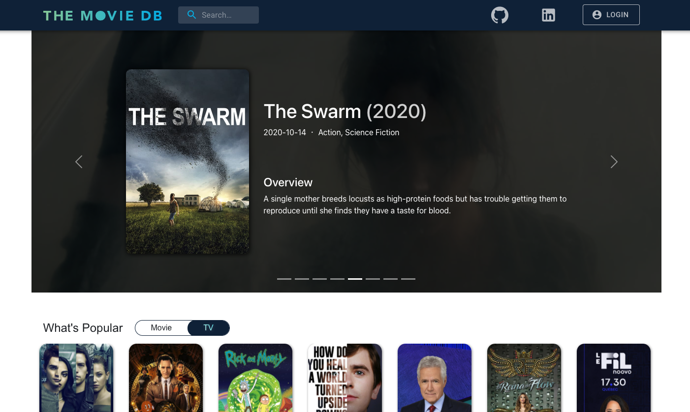
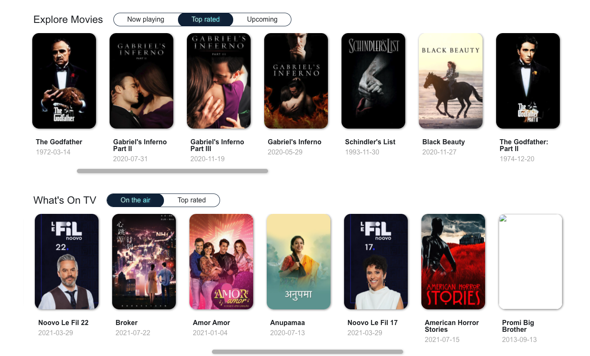

# DB-MOVIE

DB-MOVIE is an single page app for Movie/TV browsing and help users to discover their next show by reliable stats.

### Front end

- [x] react-app
- [x] bootstrip, material-UI

### Back end

- [x] Express
- [x] node-cache
- [x] axios

The back-end repo was built using Node.js and Express with third party(TMDB) API integration. Also the API request performance is optimized by caching for storing and retrieving response data.
&nbsp;
&nbsp;

## Screen Shot

#### Home page part1

#### Home page part2

## Dependencies

- React.js
- Node.js
- Express
- Material-UI
- bootstrap
- node-cache

## Available Scripts

In the Front-end directory (DB-MOVIE/client), you can run:

### `npm start`

Runs the app in the development mode. 
Open [http://localhost:3000](http://localhost:3000) to view it in the browser.

The page will reload if you make edits. 
You will also see any lint errors in the console.

In the Back-end directory (DB-MOVIE/server), you can run:

### `npm start`

Runs the server in the development mode.
Call (http://localhost:8000) followed by listed routes to fetch data in the browser.

|        Routes         | Method |            params            | Response body               |
| :-------------------: | :----: | :--------------------------: | --------------------------- |
|       /api/ping       |  get   |             N/A              | success message             |
| /api/movie/`<params>` |  get   |  popular/top_rated/upcoming  | sorted data / error message |
|  /api/tv/`<params>`   |  get   | popular/top_rated/on_the_air | sorted data / error message |
